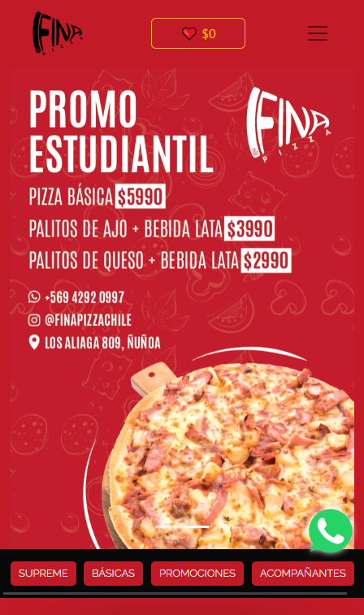

# Prueba final modulo React II

## E-Commerce FinaPizza

### Trabajo elaborado con React y vite para la empresa de un compañero también dedicado al rubro gastronómico igual que yo. En esta aplicación sencilla le doy las herramientas para que por medio de un código QR sus clientes puedan acceder al menu y promociones que ofrece, también contiene una sección de favoritos para facilitar la elección del producto. También tiene secciones informativas de la marca, una sección de contacto para que le puedan  mandar email directos a su correo corporativo como también el icono de Whatsapp para escribirle directamente por cualquier necesidad. Utilice para este proyecto los Hooks que ofrece React como React-router Dom, Context, Provider, Use effect y fetch para llamar a la Api. Aplique estilos con Css Bootstrap y Material UI. El mailing lo implementé con Email.js y la localización con Leaflet

#### Esta es una vista previa del proyecto

- 

#### Visita esta pagina 🙂

- [Deployed](https://finapizza-chile.netlify.app/)
  